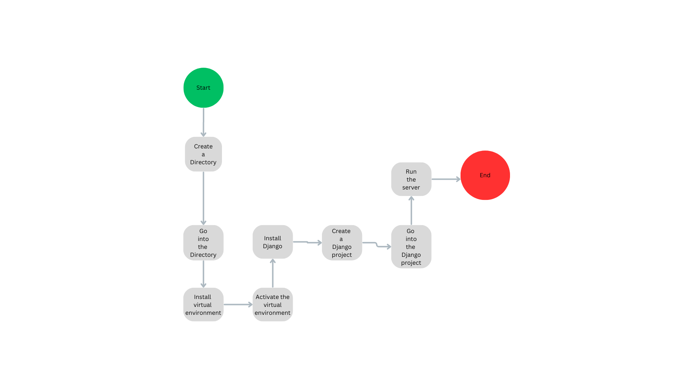
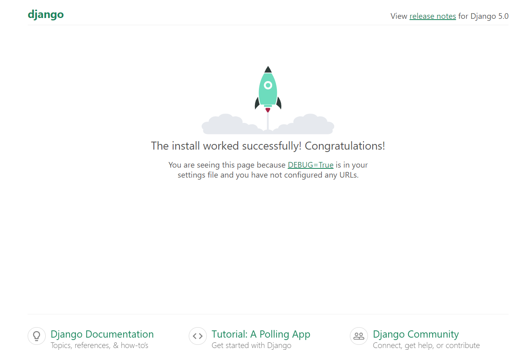
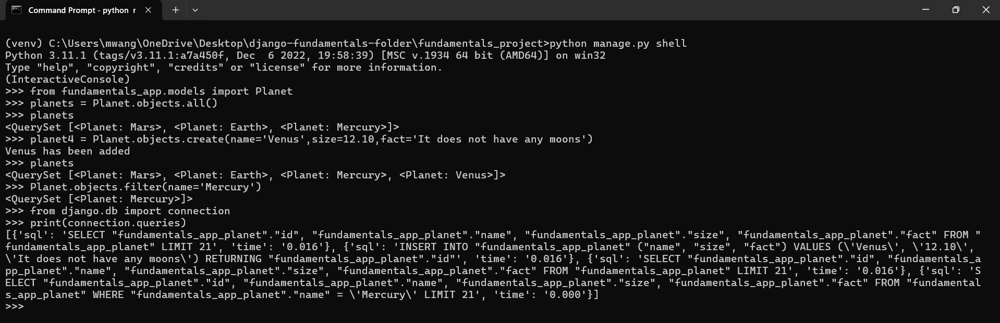
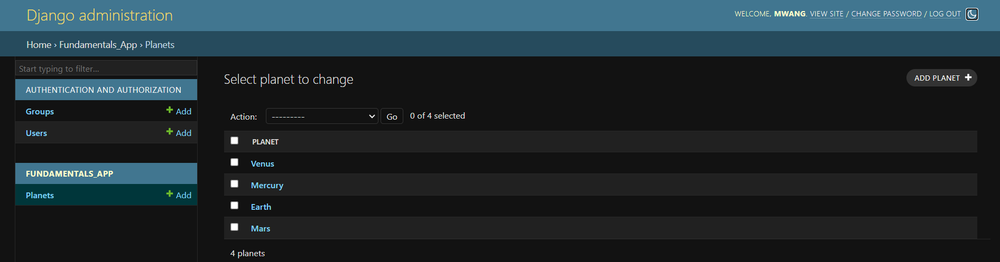

## 1. Django Setup And Installation

The flowchart below shows how to easily install and setup a Django project

### Steps

1. **Create a Directory on Desktop**
   - Open your desktop and create a new folder.
   - Example: ` django_project`

2. **Using cmd, enter the directory**
   - Open Command Prompt.
   - Go into your new folder: `cd path/to/your/directory`

3. **Install Virtual Environment**
   - Install `virtualenv` globally if not already installed: `pip install virtualenv`
  

4. **Name your virtual environment**
   - Choose a name for your virtual environment.
   - Example: `virtualenv venv`

5. **Activate the virtual environment**
   - On Windows: `venv\Scripts\activate`
   - On macOS/Linux: `source venv/bin/activate`

6. **Install Django**
   - While the virtual environment is activated, install Django: `pip install django`

7. **Create a Django Project**
   - Create a new Django project: `django-admin startproject project_name`

8. **Enter the Django Project**
   - Go into your project directory: `cd project_name`

9. **Run the Server to Confirm Installation was Successful**
   - Start the Django development server: `python manage.py runserver`
   - Click on `http://127.0.0.1:8000/` to see the Django welcome page.

   

10. **End**
    - Your Django setup is complete!

#### Django Project 

A Django project has got a collection of different settings, configurations, and apps. We can have one or more apps in a single project.

#### Django app
An app or application is used to do a specific task. Each app made in Django has got URLs, views, models, and templates.

To create a Django app in a Django project
>> * Go into your Django Project directory  `cd path/to/your/project_name`

>> * Then write `django-admin startapp app_name`

###### After creating Django app
>> 1. Open the the project directory (`django_project`) on vscode 
>> 2. Go to `settings.py` in the project

>> 3. Look for INSTALLED_APPS and under it include and save

>>>* ` INSTALLED_APPS = [
    'django.contrib.admin',
    'django.contrib.auth',
    'django.contrib.contenttypes',
    'django.contrib.sessions',
    'django.contrib.messages',
    'django.contrib.staticfiles',
    'app_name',
] `

[Click here to read more](https://www.cloudwithdjango.com/django-understanding-the-concept-of-a-django-app/)

#### Django QuerySet

* A QuerySet is a collection of data from a database

*It makes it easier to get the data you really need.

##### Run  `python manage.py shell` On Cmd

1. To import the database model use `from myapp.models import Model_name`

2. To get all the objects from the database use `Model_name.objects.all()`

3. To add a new object into the database use `Model_name.objects.create()`

4. To get certain objects from the database use `Model_name.objects.filter()`

5. To check all the queries you have made use `from django.db import connection`

6. Then `print(connection.queries)` to see the queries

##### Database view

